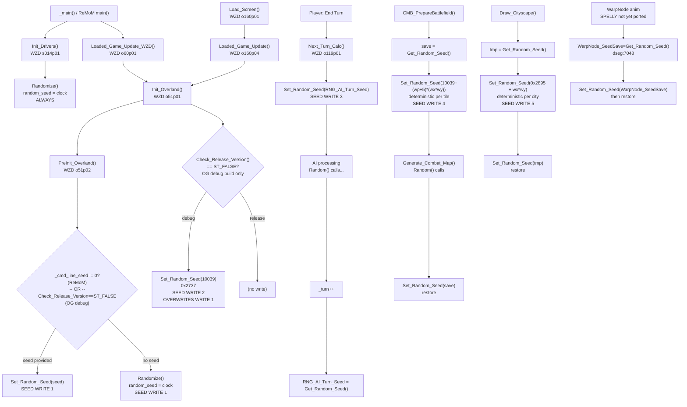

# MoM PRNG Paths — DOSBox-Debug / ReMoM Match-Up Reference

Sources used:
- `C:\STU\devel\ReMoM\MoX\src\random.c`
- `C:\STU\devel\ReMoM\MoM\src\Init.c`
- `C:\STU\devel\ReMoM\MoM\src\LoadScr.c`
- `C:\STU\devel\ReMoM\MoX\src\MOX2.c`
- `C:\STU\devel\ReMoM\MoM\src\NEXTTURN.c`
- `C:\STU\devel\ReMoM\MoM\src\Combat.c`
- `C:\STU\devel\ReMoM\MoM\src\CITYSCAP.c`
- `C:\STU\devel\ReMoM\MoM\src\MainScr_Maps.c`
- `C:\STU\devel\STU-Extras\Piethawn\Piethawn\out\WIZARDS\dseg\_misc.asm`

---

## Key PRNG Variables (WIZARDS.EXE dseg)

| Variable            | Type | WZD dseg offset | Init value                   | Notes                                      |
|---------------------|------|-----------------|------------------------------|--------------------------------------------|
| `random_seed`       | `dd` | `dseg:7846`     | `0x35683568`                 | Main PRNG state. Written by every seed-set call; advanced by every `Random()` call |
| `WarpNode_SeedSave` | `dd` | `dseg:7048`     | `0x000F9F9B`                 | Save slot for warp-node animation PRNG     |
| `RNG_AI_Turn_Seed`  | `dd` | dseg:5E92      | `0x2A57` (binary `10101001010111b`) | Saved AI-turn seed; restored each turn start |
| `_turn`             | `dw` | `dseg:BD90`     | `0`                          | Incremented inside `Next_Turn_Calc()`      |

**DOSBox-Debug formulas:**
```
linear_addr = (DS * 16) + dseg_offset
BPWRITE DS:7846          ; break on any random_seed write
D DS:7846 L4             ; display random_seed
D DS:BD90 L2             ; display _turn
```

---

## PRNG Functions (WIZARDS.EXE)

| Function          | WZD loc      | Behaviour                                                      |
|-------------------|--------------|----------------------------------------------------------------|
| `Randomize()`     | seg022 p07   | Reads system clock timer → writes `random_seed`               |
| `Set_Random_Seed` | seg022 p05   | Writes `random_seed` directly from argument                   |
| `Get_Random_Seed` | seg022 p06   | Returns current `random_seed`                                 |
| `Random(n)`       | seg022 p08   | Xorshift32 on `random_seed`; returns `1..n`                   |

---

## All Seed-Write Paths

### Path 1 — Program Start (`Init_Drivers`, unconditional)

```
_main()
  └─> Init_Drivers()                     [WZD s014p01, Init.c:44]
        └─> Randomize()                  [seg022p07]
              random_seed = Read_System_Clock_Timer()
```

- Always fires on startup, both OG-MoM and ReMoM.
- No override possible here.
- **DOSBox capture**: BP at `Randomize` entry; read `DS:7846` on ret.

---

### Path 2 — Load/New Game → `Init_Overland` → `PreInit_Overland`

Two `Check_Release_Version()`-gated writes happen on this path.

```
Load_Screen()                            [WZD o160p01]
  └─> Loaded_Game_Update()              [WZD o160p04, LoadScr.c:733]
        └─> Init_Overland()             [WZD o51p01,  LoadScr.c:862]
              │
              ├─> PreInit_Overland()    [WZD o51p02,  LoadScr.c:969]
              │     ┌─────────────────────────────────────────────┐
              │     │  SEED WRITE #1                              │
              │     │  OG-MoM disasm (MoO2 branch):              │
              │     │    call  Check_Release_Version              │
              │     │    cmp   _cmd_line_seed, 0                  │
              │     │    jz    Randomize()   <- release build     │
              │     │    call  Set_Random_Seed(_cmd_line_seed)    │
              │     │                        <- debug build only  │
              │     │                                             │
              │     │  ReMoM port (LoadScr.c:1003):              │
              │     │    if (_cmd_line_seed != 0)                 │
              │     │        Set_Random_Seed(_cmd_line_seed)      │
              │     │    else                                     │
              │     │        Randomize()   <- clock (normal)      │
              │     └─────────────────────────────────────────────┘
              │
              └─> [city/unit init, map setup ...]
              │
              └─> if (Check_Release_Version() == ST_FALSE)
                    ┌─────────────────────────────────────────────┐
                    │  SEED WRITE #2                              │
                    │  Set_Random_Seed(10039)  // 0x2737          │
                    │  OG DEBUG BUILD ONLY                        │
                    │  Overwrites whatever #1 set.                │
                    │  LoadScr.c:947-951                          │
                    └─────────────────────────────────────────────┘
```

**Also via `_main()` / New Game path:**
```
_main()
  └─> Loaded_Game_Update_WZD()          [WZD o60p01, NEXTTURN.c:143]
        └─> Init_Overland()             [same chain as above]
```

**Summary:**

| Build              | Seed after `Init_Overland` completes                             |
|--------------------|------------------------------------------------------------------|
| OG release         | `Randomize()` clock from `PreInit_Overland` — never overwritten |
| OG debug           | `10039` (0x2737) — forced by `Init_Overland` tail               |
| ReMoM `--seed N`   | `N` — then possibly overwritten by #2 if debug build            |
| ReMoM (no seed)    | `Randomize()` clock — then possibly overwritten by #2 if debug  |

---

### Path 3 — `Next_Turn_Calc()` (every player turn)

```
[player clicks End Turn]
  └─> Next_Turn_Calc()                  [WZD o119p01, NEXTTURN.c:611]
        │
        ├─> Set_Random_Seed(RNG_AI_Turn_Seed)       <- SEED WRITE #3
        │     First turn: RNG_AI_Turn_Seed = 0x2A57
        │
        ├─> [All_City_Calculations, AI_Overland_Turn, spell casting ...]
        │     All Random() calls here consume the AI seed
        │
        ├─> _turn++
        │
        └─> RNG_AI_Turn_Seed = Get_Random_Seed()    <- SEED SAVE
              Saved for next turn's determinism
```

---

### Path 4 — Combat Map Generation (save/restore)

```
CMB_PrepareBattlefield()               [Combat.c:26206]
  ├─> save = Get_Random_Seed()
  ├─> Set_Random_Seed(10039 + (wp+5)*(wx*wy))       <- SEED WRITE #4
  │     deterministic per combat tile location
  ├─> Load_Combat_Terrain_Pictures(...)
  ├─> Generate_Combat_Map(...)         [Combat.c:26301]
  │     ├─> inner_save = Get_Random_Seed()
  │     ├─> [Random() calls for houses, terrain ...]
  │     └─> Set_Random_Seed(inner_save)              <- inner restore
  └─> Set_Random_Seed(save)                          <- outer restore
```

---

### Path 5 — Cityscape Display (save/restore)

```
Draw_Cityscape()                       [CITYSCAP.c:202]
  ├─> tmp = Get_Random_Seed()
  ├─> Set_Random_Seed(0x2895 + city_wx * city_wy)   <- SEED WRITE #5
  │     deterministic per city tile position
  ├─> [draw buildings]
  │   NOTE: BUGBUG — no Random() calls actually consumed (ReMoM comment)
  └─> Set_Random_Seed(tmp)                           <- restore
```

---

### Path 6 — WarpNode Animation (SPELLY — not yet ported to ReMoM)

```
// MainScr_Maps.c:2547 — all SPELLY, commented out
WarpNode_SeedSave = Get_Random_Seed()  // dseg:7048
  └─> [animate warp node]
        tmp = Get_Random_Seed()
        Set_Random_Seed(WarpNode_SeedSave)
        [... warp node random draws ...]
        Set_Random_Seed(tmp)                         <- restore
```

---

## DOSBox-Debug Capture Checklist

| Checkpoint                          | Command                                                        |
|-------------------------------------|----------------------------------------------------------------|
| Seed after startup `Randomize()`    | BP at `Randomize` ret; `D DS:7846 L4`                          |
| Seed after `PreInit_Overland` (#1)  | BP at `PreInit_Overland` ret; `D DS:7846 L4`                   |
| Seed after `Init_Overland` (#2)     | BP at `Init_Overland` ret; `D DS:7846 L4`                      |
| `Check_Release_Version` result      | BP at call site; AX on ret — 0=debug, 1=release                |
| Seed at `Next_Turn_Calc` entry (#3) | BP at first inst of o119p01; `D DS:7846 L4`                    |
| `RNG_AI_Turn_Seed` saved at turn end | BP at `RNG_AI_Turn_Seed = Get_Random_Seed()` site             |
| `_turn` value                       | `D DS:BD90 L2` at any BP                                       |
| All `random_seed` writes            | `BPWRITE DS:7846`                                              |

---

## ReMoM vs OG-MoM Match-Up Strategy

1. **Startup seed**: both call `Randomize()` in `Init_Drivers`. OG release build: seed is clock-based. OG debug build: `Init_Overland` forces it to `10039`.
2. **Force determinism**: use `--seed 10039` in ReMoM `--continue` to match OG debug build.
3. **Per-turn**: both restore `RNG_AI_Turn_Seed` at `Next_Turn_Calc` entry. Capture both sides; they must match for deterministic replay.
4. **Combat / Cityscape**: coordinate-based seeds match automatically if tile coords match.
5. **Divergence detection**: any extra or missing `Random()` call shifts `random_seed`. ReMoM outputs `[RNG]` lines to stderr with call counts.

---

## Mermaid Diagram

